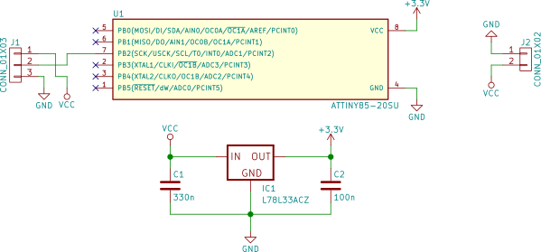

# 🔌 Dell Charger Emulator 

Make your ATTiny85 emulate a original dell charger.

The power adapters used for Dell laptops contain a IC to report the adapter capabilities (like watts, voltage and current).
If you connect a third- party adapter, the laptop will refuse to charge the battery.
This project allows you to use a [ATTiny85](https://www.microchip.com/en-us/product/ATTINY85) (and possibly also other microcontrollers) to emulate the answers a dell laptop expects from the charger. 

You can configure the adapter setting in the source file [rom.h](src/rom.h).
For details on the fields function see the comments.

When you change the values, you'll have to update the `ROM_CHECKSUM`. This can be done using a tool like [crccalc.com/](https://crccalc.com/).

For developer reference, here is the raw ROM layout

| Offset | Length | Content                 | Description              |
|--------|--------|-------------------------|--------------------------|
|      0 |      4 | DELL                    | Manufacturer identifier  |
|      4 |      4 | 00AC                    | Adapter type             |
|      8 |      3 | 045                     | Watts (45W)              |
|     11 |      3 | 195                     | Tenths of a volt (19.5V) |
|     14 |      3 | 023                     | Tenths of amps (2.3A)    |
|     17 |     23 | CN0CDF577243865Q27F2A05 | Serial number            |
|     40 |      2 | 0x3D 0x94               | CRC-16/ARC (LSB first)   |

**Warning: do not mask the weak power adapter to a more powerful one. This can lead to hardware damage.**

## Schematic

You'll need a ATTiny85 MCU (ATTiny25, ATTiny45, and possibly other AVR MCUs may also work) running at either 8 MHz (the internal clock is suitable for this). 
When using a different MCU __or__ clock speed, you'll have to adjust the platformIO environment.

The Dell power adapter plug has three pings - GND, VOut (+19V) and ID.
GND is the outer- most, VOut is the inside of the barrel, and ID is the small pin in the barrel connector.

Connect the ID pin to the PB2 pin of the ATTiny. The MCU must be powered from 3.3V (ID pin may work with 5V, not sure about that...).

## Reading and writing EEPROM

The [original code by KivApple](https://github.com/KivApple/dell-charger-emulator) used the onboard EEPROM to store the configuration values, and also supported re- writing the EEPROM via the ID pin. 
In the platformIO version, this functionality was removed. to change ROM values, you'll have to flash the whole IC.
(or look at a previous commit which still had the EEPROM code included).
